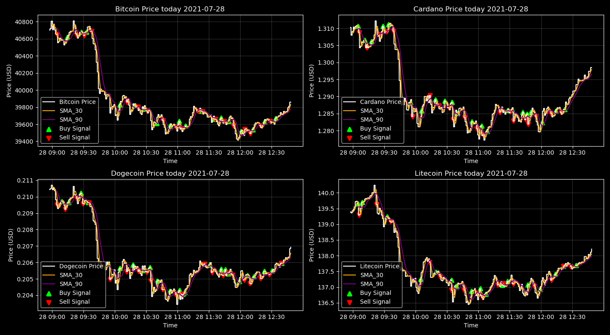

# Cryptocurrencies Screener

In this project I am creating a system for monitoring some list of cryptocurrencies daily and send a automatic email at the end of the day with the most import informations.  

### Step 1: Streaming cryptocurrencies price screener

In this first part of the project I created a screening system that scrapes data in real time from the [Yahoo Finance](https://finance.yahoo.com/cryptocurrencies) website using Selenium (I just could not make it work with BeautifulSoup yet) and plots the cryptocurrencies prices together with two moving averages. Those moving averages will be used the second part of the project, that is to create a simple algorithmic trading system based on the moving averages. Bellow you can see a screenshot of the screener.

### Step 2: Algorithmic trading

Now let's add a pintch of complexity to this project. Starting with a algorithmic trading-like strategy. I mean "like" because I would not bet a single cent in this algorithmic, I will use it with educational purpose only.

So, a common and simple strategy for algorithmic trading is using the crossing of different moving averages as signals to buy or sell a stock or a cryptocurrency. For start let's consider the 30 seconds and 90 seconds moving average. The algorithmic works as follows:

<ol>
<li>If the shorter moving average crosses up the longer moving average it will emit a signal to buy the share because hypothetically it means that the cryptocurrency (or stock) will increase after that. And it is necessary to set up a variable that identifies if a action (buy or sell) has already being made.
I do not want that the same action is taken in sequency. </li>

<li>If the shorter moving average crosses down the bigger one it will emit a signal to sell the share Because the share price will fall after that. </li>
</ol>
       
A result from this process can being see bellow.

The result of this strategy does not seems the worst thing in the World. The algorithm can the quite messy under small changes and fluctuations, but when it comes to big price variations it can get it pretty right.

There is two things that could enhance this methodology:
1. Having a validation method do calculate how much profit this algorithm can return.  
2. How which is the best combination of moving averages that leads to best profit.

<i>(continues...)</i>
