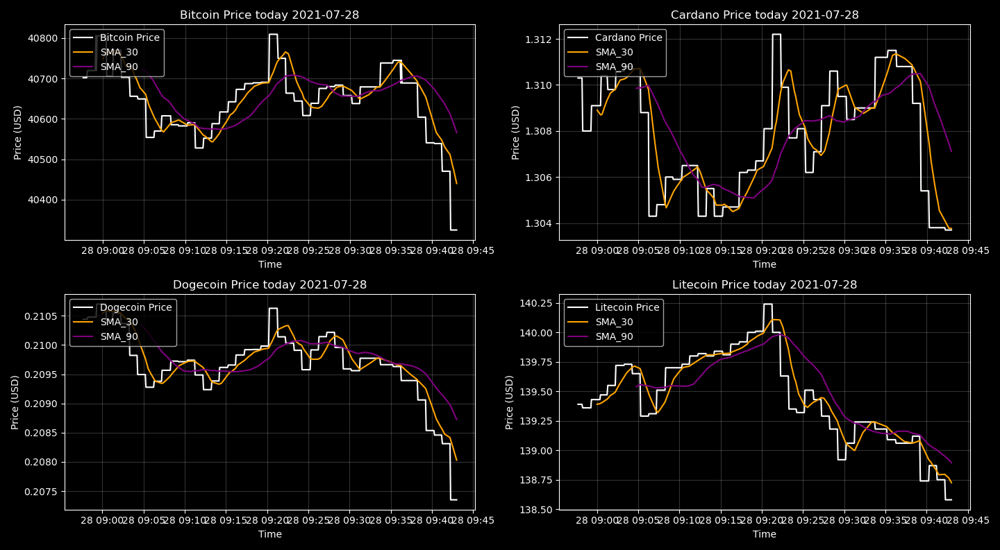

# Cryptocurrencies Screener

In this project I am creating a system for monitoring some list of cryptocurrencies daily and send a automatic email at the end of the day with the most import informations.  

In this first part of the project I created a screening system that scrapes data in real time from the [Yahoo Finance](https://finance.yahoo.com/cryptocurrencies) website using Selenium (I just could not make it work with BeautifulSoup yet) and plots the cryptocurrencies prices together with two moving averages. Those moving averages will be used the second part of the project, that is to create a simple algorithmic trading system based on the moving averages. Bellow you can see a screenshot of the screener.

Later I will add a emailling system to send a summary of the information in a specific day. 

